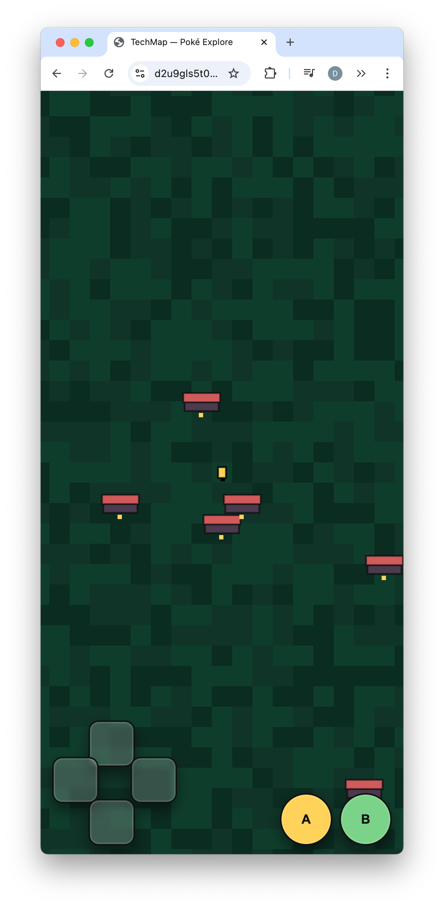

# TechMap AWS — Because Clouds Need Supervision

<div align="center">

<!-- It’s badge o’clock. Enjoy the retina burn. -->


-success?style=for-the-badge)


 </div>

Welcome to TechMap AWS, a TypeScript CDK project that deploys a static site on CloudFront + S3, a DynamoDB table, two Lambda functions, an API Gateway REST API, and a scheduled refresh job. It’s opinionated, reasonably small, and built to get you from zero to useful quickly.

<p align="center">
  
  <!-- Set explicit width so it renders smaller on GitHub -->
</p>

## What Is This?

- TypeScript CDK app for a small web/data stack.
- Static site served via CloudFront with S3 origin.
- API Gateway proxying to Lambda for `GET /api/companies`.
- DynamoDB on-demand table for storage.
- EventBridge rule to refresh data on a schedule.

## Features

- Single stack with sensible defaults.
- Secure by default (S3 private + OAI, HTTPS only).
- CORS enabled for the API.
- Zero-config table/func names; outputs include API URL and CloudFront domain.

## Repo Layout

- `infra/` — CDK app and stack code. Class: `InfraStack`; stack id: `techmap`.
- `lambda/` — Lambda handlers: `getCompanies.js`, `refresh.js`.
- `infra/site/` — Static site assets deployed to S3 and served by CloudFront.

## Quickstart

You’ll need Node 18+, AWS credentials, and permissions to create IAM roles, CloudFront, S3, API Gateway, DynamoDB, and EventBridge.

```bash
# 1) Install deps
cd infra && npm install

# 2) Optional: build TypeScript
npm run build

# 3) (First time per account/region) Bootstrap
npx cdk bootstrap

# 4) See the plan
npx cdk diff techmap

# 5) Deploy the stack
npx cdk deploy techmap

# 6) Tear it down
npx cdk destroy techmap
```

## Useful Commands

```bash
cd infra
npm run build          # Compile TS
npx cdk list           # Stacks in this app
npx cdk synth techmap  # Generate CloudFormation
npx cdk doctor         # Environment diagnostics
```

## FAQ

- “What’s the stack name?”  
  The stack id is `techmap`. The CDK app instantiates `new InfraStack(app, 'techmap')`.

- “Is this safe to deploy?”  
  It defaults to `RemovalPolicy.DESTROY` for convenience. Change to `RETAIN` for production and review IAM policies.

- “Where do I find endpoints?”  
  After deploy, check the CDK outputs for `ApiUrl` and `CloudFrontDomain`.

- “Why so many badges?”  
  Management asked for “more visibility.” We delivered.

## Contributing

PRs welcome! Extra points for PR titles that double as haikus and commit messages that follow Conventional Commits so the release notes look like they were written by a very organized robot.

## License

ISC — the ‘I’m So Chill’ license. See `package.json` for details you will not read.

---

If you made it this far, congrats. You’re the SRE now.
